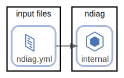
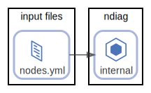
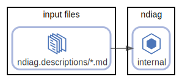

# input

## 入力

`ndiag doc` の入力は以下の3種類です。

1. [nodes.yml](/example/3-tier/input/nodes.yml)
    - 信頼できる情報源から得たNodeやComponent、Network、Relationのデータです。
    - 信頼できる情報源とするために、例えばあるインフラのアーキテクチャドキュメントを生成する場合、インフラから収集したサーバやVMインスタンスの情報やミドルウェアの情報からnodes.ymlを機械的に生成することが望ましいです。
        - Terraformの `*.tf` や `*.tfstate`
        - Chefの `nodes/`
        - `kubectl get nodes` `kubectl get pods`
        - etc.
    - できる限り最新の情報を継続的に取得できるような仕組みを作ると良いでしょう。
2. [ndiag.yml](/example/3-tier/input/ndiag.yml)
    - 生成するドキュメントの設定と、nodes.ymlとして生成できなかった情報を補完するための設定ファイルです。
        - ドキュメントの出力ディレクトリ `docPath:`
        - 説明文章サブセットmdファイルのディレクトリ `descPath:`
        - ドキュメントの体裁の設定
        - Nodeをまとめるための設定 ( `nodes:` )
        - etc.
3. [ndiag.descriptions/*.md (descPath)](/example/3-tier/input/ndiag.descriptions)
    - NodeやComponent、生成したアーキテクチャ図の説明文章を記載するためのサブセットmdファイルです。
    - `ndiag doc` を実行すると、ndiag.ymlの `descPath` に設定されたディレクトリにサブセットmdファイルが（存在しない場合）空ファイルとして生成されます。

入力処理の流れとしては以下のようになります。

1. nodes.ymlのNodeの情報をndiag.ymlの `nodes:` の情報でまとめる
2. nodes.ymlのNode以外の情報をndiag.ymlの `components:` `relations:` `networks:` などにマージしていく
3. 2まででまとめた情報から必要な説明文章サブセットmdファイルを `descPath:` ( default `ndiag.descriptions/` ) に指定されたディレクトリからファイル名を指定して読み込む。
    - もしファイルがなければ空ファイルを生成する

３の時点で `ndiag:intenal` には必要な情報が構造化されて保持されています。

  [ <a href="../ndiag.descriptions.ja/_view-input.md">:pencil2: Edit description</a> ]

## 構成要素

| Name | Description |
| --- | --- |
| [input files](node-input_files.md) | <a href="../ndiag.descriptions.ja/_node-input_files.md">:pencil2:</a> |
| [ndiag](node-ndiag.md) | `ndiag doc` コマンド |

## Relations

  [ <a href="../ndiag.descriptions.ja/_relation-input_files_ndiag.yml-da3a497.md">:pencil2: Edit description</a> ]

| # | Component | Description |
| --- | --- | --- |
| 0 | input files:ndiag.yml |  <a href="../ndiag.descriptions.ja/_component-input_files_ndiag.yml.md">:pencil2:</a> |
| 1 | ndiag:internal | ndiagの内部処理 <a href="../ndiag.descriptions.ja/_component-ndiag_internal.md">:pencil2:</a> |

---

  [ <a href="../ndiag.descriptions.ja/_relation-input_files_nodes.yml-efaf14b.md">:pencil2: Edit description</a> ]

| # | Component | Description |
| --- | --- | --- |
| 0 | input files:nodes.yml |  <a href="../ndiag.descriptions.ja/_component-input_files_nodes.yml.md">:pencil2:</a> |
| 1 | ndiag:internal | ndiagの内部処理 <a href="../ndiag.descriptions.ja/_component-ndiag_internal.md">:pencil2:</a> |

---

  [ <a href="../ndiag.descriptions.ja/_relation-input_files_ndiag.descriptions__.md-1cdb9dd.md">:pencil2: Edit description</a> ]

| # | Component | Description |
| --- | --- | --- |
| 0 | input files:ndiag.descriptions/*.md |  <a href="../ndiag.descriptions.ja/_component-input_files_ndiag.descriptions__.md.md">:pencil2:</a> |
| 1 | ndiag:internal | ndiagの内部処理 <a href="../ndiag.descriptions.ja/_component-ndiag_internal.md">:pencil2:</a> |

---
---

> Generated by [ndiag](https://github.com/k1LoW/ndiag)
